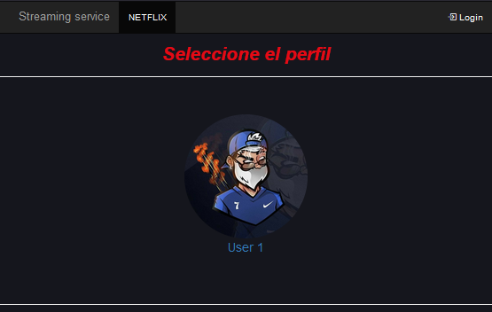

# StreamingCES

#### Universidad Autónoma de la Ciudad de México

#### Ingenieria en software

#### Nombre: Daniel Ramírez Sánchez

#### Materia: Construccion y evolucion de software

- Practicas de la materia Construccion y Evolucion de Software
  - Practica 1: Aplicación tipo CRUD para una empresa de servicios de streaming.
  - Practica 2: Implementacion las técnicas y estándares de codificación
  - Practica 3: Implemente y ejecute pruebas unitarias sobre código empleando la herramienta automática JUnit.

Software: NetBeans 8.2, JDK 8, Glasfish 4.1.1, Spring Framework 4.0.1
